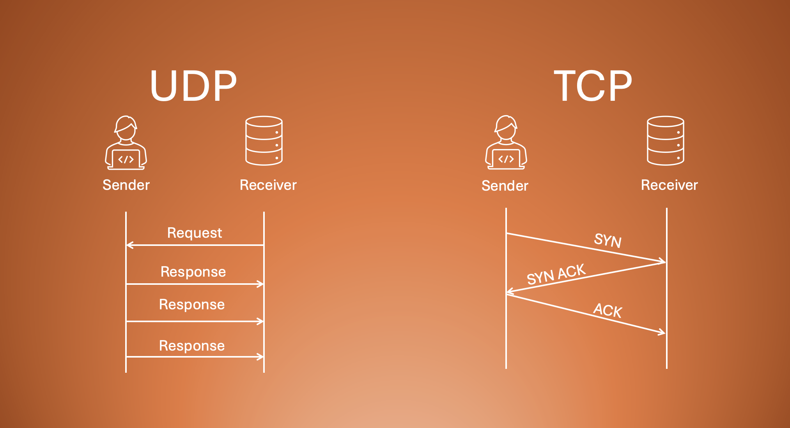
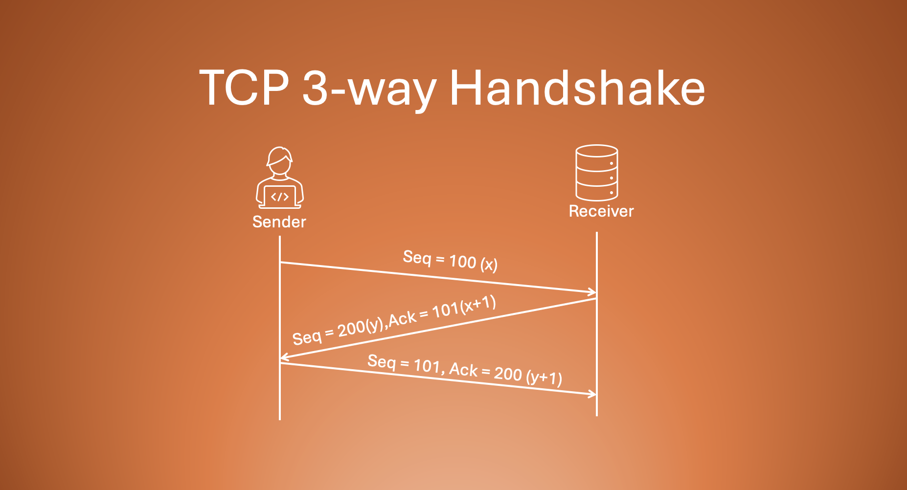
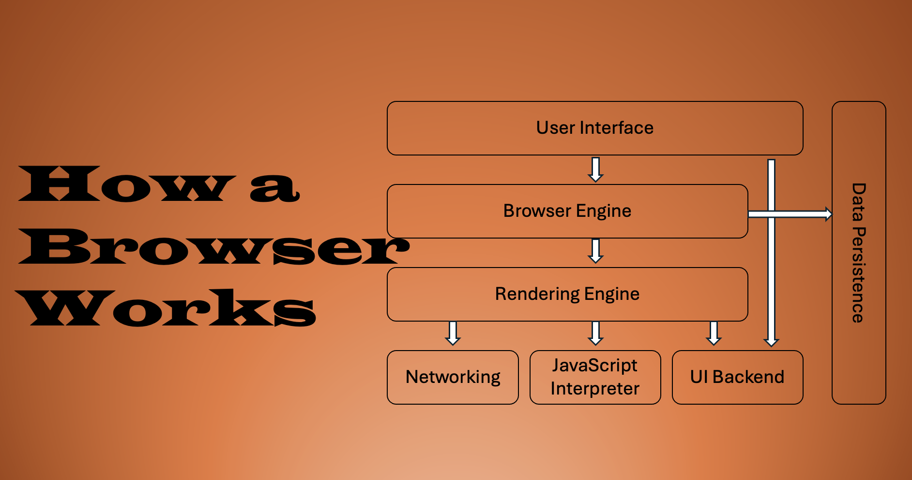

<a href="https://hashnode.com/@RajatJaiswal">
  <h1 align="center">Articles</h1>
</a>

  Journey of my learning through writing technical articles on various web development topics.

### [Introduction to Git](https://gitbeginners.hashnode.dev/the-secret-life-of-git)

  <a href="https://gitbeginners.hashnode.dev/the-secret-life-of-git">
      

      
    

  </a>

### [Beginer's guide to git](https://gitbeginners.hashnode.dev/building-your-digital-lego-city-a-beginners-guide-to-git-magic)

  <a href="https://gitbeginners.hashnode.dev/building-your-digital-lego-city-a-beginners-guide-to-git-magic">
      

      
    

  </a>

### [Version Control](https://gitbeginners.hashnode.dev/why-version-control-exists )

  <a href="https://gitbeginners.hashnode.dev/why-version-control-exists">
      

      
    

  </a>

### [Network Devices](https://networkbasic101.hashnode.dev/the-network-puzzle-understanding-gateways-guides-and-guards)

  <a href="https://networkbasic101.hashnode.dev/the-network-puzzle-understanding-gateways-guides-and-guards">
      

      
    

  </a>

### [DNS Record](https://networkbasic101.hashnode.dev/dns-record-types-explained)

  <a href="https://networkbasic101.hashnode.dev/dns-record-types-explained">
      

      
    

  </a>

### [DNS Resolution](https://networkbasic101.hashnode.dev/how-dns-resolution-works)

  <a href="https://networkbasic101.hashnode.dev/how-dns-resolution-works">
      

      
    

  </a>

### [Curl Command](https://networkbasic101.hashnode.dev/getting-started-with-curl)

  <a href="https://networkbasic101.hashnode.dev/getting-started-with-curl">
      

      
    

  </a>

### [TCP vs UDP](https://networkbasic101.hashnode.dev/tcp-vs-udp)

  <a href="https://networkbasic101.hashnode.dev/tcp-vs-udp">
      

      
    

  </a>

### [TCP 3-way Handshake](https://networkbasic101.hashnode.dev/how-tcp-works)

  <a href="https://networkbasic101.hashnode.dev/how-tcp-works">
      

      
    

  </a>

### [Emmet for HTML](https://html-css-basics.hashnode.dev/emmet-for-html)

  <a href="https://html-css-basics.hashnode.dev/emmet-for-html">
      

      
    

  </a>

### [How Browsers Work](https://html-css-basics.hashnode.dev/how-a-browser-works)

  <a href="https://html-css-basics.hashnode.dev/how-a-browser-works">
      

      
    

  </a>

### [Understanding HTML Tags and Elements](https://html-css-basics.hashnode.dev/understanding-html-tags-and-elements)

  <a href="https://html-css-basics.hashnode.dev/understanding-html-tags-and-elements">
      

      
    

  </a>

### [CSS Selectors 101](https://html-css-basics.hashnode.dev/css-selectors-101)

  <a href="https://html-css-basics.hashnode.dev/css-selectors-101">
      

      
    

  </a>

