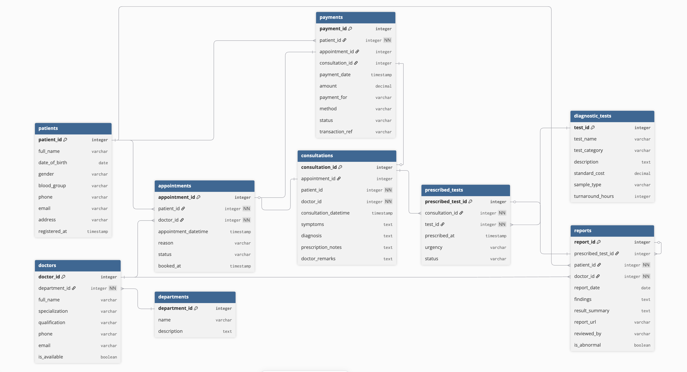

# 🏥 Clinic Appointment and Diagnostics Platform — Database Design

ER diagram and documentation for a modern clinic management system.

## 📌 Business Overview

A clinic wants to digitally manage:
- **Doctors** across different specialties/departments
- **Patients** who visit the clinic multiple times
- **Appointments** booked by patients with specific doctors
- **Consultations** that result from completed appointments
- **Diagnostic Tests** prescribed during consultations
- **Reports** generated after test completion
- **Payments** tied to appointments or consultations

---

## 🗂️ Entities at a Glance

| Entity | Purpose |
|--------|---------|
| `PATIENT` | People registered at the clinic |
| `DEPARTMENT` | Clinical departments (e.g., Cardiology, ENT) |
| `DOCTOR` | Doctors with their specialty and department |
| `APPOINTMENT` | A booking made by a patient with a doctor |
| `CONSULTATION` | The actual doctor-patient visit that results from a completed appointment |
| `DIAGNOSTIC_TEST` | Master list of available tests (e.g., CBC, X-Ray, MRI) |
| `PRESCRIBED_TEST` | Tests prescribed during a specific consultation (junction table) |
| `REPORT` | Results/findings generated after a test is completed |
| `PAYMENT` | Payment records linked to an appointment or consultation |

---

## 🔧 Notation Used

- **Crow's Foot notation** in the Mermaid ER diagram
- `🔑` = Primary Key, `🔗` = Foreign Key
- Cardinality: `||--||` (one-to-one), `||--o{` (one-to-many), `}o--o{` (many-to-many)

---

## 📊 ER Diagram:

---

## 🔑 Design Highlights:

- **APPOINTMENT ≠ CONSULTATION** — An appointment is a booking; a consultation is the actual visit. Not every appointment results in a consultation (e.g., cancellations, no-shows).
- **PRESCRIBED_TEST** is a junction table resolving the M:N between CONSULTATION and DIAGNOSTIC_TEST, with extra fields like `urgency` and `status`.
- **REPORT** links back to `prescribed_test_id`, `patient_id`, and `doctor_id` for full traceability.
- **PAYMENT** supports both appointment-level billing (registration fee) and consultation-level billing (doctor fee + test charges).
- **DEPARTMENT** is a separate entity — allows clean grouping of doctors and future extensibility.

##### Detailed table decription and its attributes are defined in entities.md file

---

## Table Relationships:

### 1. DEPARTMENT → DOCTOR
**Cardinality:** One-to-Many (`1:N`)

- One department can have **many doctors**
- Each doctor belongs to **one department**
- **FK:** `DOCTOR.department_id` → `DEPARTMENT.department_id`

---

### 2. PATIENT → APPOINTMENT
**Cardinality:** One-to-Many (`1:N`)

- One patient can book **many appointments** over time
- Each appointment is for **one patient**
- **FK:** `APPOINTMENT.patient_id` → `PATIENT.patient_id`

---

### 3. DOCTOR → APPOINTMENT
**Cardinality:** One-to-Many (`1:N`)

- One doctor can be scheduled for **many appointments**
- Each appointment is with **one doctor**
- **FK:** `APPOINTMENT.doctor_id` → `DOCTOR.doctor_id`

---

### 4. APPOINTMENT → CONSULTATION
**Cardinality:** One-to-Zero/One (`1:0..1`)

- One appointment **may result in** one consultation
- A cancelled or no-show appointment has **no consultation**
- A consultation always comes from **exactly one appointment**
- **FK:** `CONSULTATION.appointment_id` → `APPOINTMENT.appointment_id` (UNIQUE)

---

### 5. CONSULTATION → PRESCRIBED_TEST (junction)
**Cardinality:** One-to-Many (`1:N`)

- One consultation can result in **many prescribed tests**
- Each prescribed test row belongs to **one consultation**
- **FK:** `PRESCRIBED_TEST.consultation_id` → `CONSULTATION.consultation_id`

---

### 6. DIAGNOSTIC_TEST → PRESCRIBED_TEST (junction)
**Cardinality:** One-to-Many (`1:N`)

- One test type can be prescribed **across many consultations**
- Each prescribed_test row references **one test type**
- **FK:** `PRESCRIBED_TEST.test_id` → `DIAGNOSTIC_TEST.test_id`

---

### 7. CONSULTATION ↔ DIAGNOSTIC_TEST (via PRESCRIBED_TEST)
**Cardinality:** Many-to-Many (`M:N`)

- One consultation can include **many tests**
- One test type can be part of **many consultations**
- **Junction Table:** `PRESCRIBED_TEST` with extra fields: `urgency`, `status`, `prescribed_at`

---

### 8. PRESCRIBED_TEST → REPORT
**Cardinality:** One-to-Zero/One (`1:0..1`)

- One prescribed test **may generate** one report (once results are ready)
- A report always comes from **one specific prescribed test**
- **FK:** `REPORT.prescribed_test_id` → `PRESCRIBED_TEST.prescribed_test_id` (UNIQUE)

---

### 9. PATIENT / DOCTOR → REPORT
**Cardinality:** One-to-Many (`1:N`) for both

- Direct FKs in REPORT for `patient_id` and `doctor_id` allow reports to be fetched without chain-joining through PRESCRIBED_TEST → CONSULTATION → APPOINTMENT

---

### 10. PATIENT → PAYMENT / APPOINTMENT → PAYMENT / CONSULTATION → PAYMENT
**Cardinality:** One-to-Many for PATIENT; One-to-Zero/One for APPOINTMENT and CONSULTATION

- `PAYMENT.appointment_id` — for booking/registration fees charged at appointment time
- `PAYMENT.consultation_id` — for consultation fees and/or test charges billed after visit
- Both FKs are nullable — only one is typically filled per payment row

---

## ❓ Questions & Answers:

## 1. Who are the doctors and what are their specialties?

 `DOCTOR` + `DEPARTMENT` tables

| Entity | Attribute | Purpose |
|--------|-----------|---------|
| `DOCTOR` | `full_name`, `specialization`, `qualification` | Doctor identity and expertise |
| `DOCTOR` | `is_available` | Whether they are currently seeing patients |
| `DEPARTMENT` | `name` | Which department they belong to |

---

## 2. Which patient booked which appointment?

 `APPOINTMENT.patient_id` → `PATIENT`

| Entity | Attribute | Purpose |
|--------|-----------|---------|
| `APPOINTMENT` | `patient_id` (FK) | Links to the patient |
| `APPOINTMENT` | `appointment_datetime`, `reason` | When and why |
| `PATIENT` | `full_name`, `phone` | Patient identity |

---

## 3. What was the appointment status?

 `APPOINTMENT.status`

| Value | Meaning |
|-------|---------|
| `'scheduled'` | Booking confirmed, visit pending |
| `'completed'` | Patient was seen — consultation exists |
| `'cancelled'` | Appointment was cancelled before visit |
| `'no_show'` | Patient did not appear |

---

## 4. Did the appointment result in a consultation?

 `CONSULTATION.appointment_id` (FK, UNIQUE)

- If a CONSULTATION row exists for an `appointment_id` → **Yes**, the visit happened
- If no CONSULTATION row exists → **No**, the appointment was cancelled or a no-show
- `APPOINTMENT.status = 'completed'` should always have a matching CONSULTATION record

---

## 5. Were any diagnostic tests prescribed?

 `PRESCRIBED_TEST` table

| Entity | Attribute | Purpose |
|--------|-----------|---------|
| `PRESCRIBED_TEST` | `consultation_id` (FK) | Which consultation prescribed tests |
| `PRESCRIBED_TEST` | `test_id` (FK) | Which test was prescribed |
| `PRESCRIBED_TEST` | `urgency`, `status` | Priority and current status |
| `DIAGNOSTIC_TEST` | `test_name`, `test_category` | What the test is |

---

## 6. What reports were generated?

 `REPORT` table

| Entity | Attribute | Purpose |
|--------|-----------|---------|
| `REPORT` | `report_date`, `findings` | When and what was found |
| `REPORT` | `result_summary` | Quick summary of results |
| `REPORT` | `is_abnormal` | Flag for out-of-range results |
| `REPORT` | `report_url` | Link to digital report |

---

## 7. Can one patient have many visits?

 `PATIENT` → `APPOINTMENT` (One-to-Many)

- Multiple APPOINTMENT rows can have the same `patient_id`
- Each completed appointment has a CONSULTATION → full visit history is maintained 

---

## 8. Can one doctor attend many patients?

 `DOCTOR` → `APPOINTMENT` (One-to-Many)

- Multiple APPOINTMENT rows can point to the same `doctor_id`
- A doctor's full schedule is queryable by filtering APPOINTMENT on `doctor_id` 

---

## 9. Can one consultation lead to multiple tests?

 `PRESCRIBED_TEST` junction table (One-to-Many from CONSULTATION)

- Multiple PRESCRIBED_TEST rows can share the same `consultation_id`
- Each row references a different test from the DIAGNOSTIC_TEST catalog 

---

## 10. How should payments be connected to visits or appointments?

 `PAYMENT` with dual nullable FKs

| Scenario | `appointment_id` | `consultation_id` | `payment_for` |
|----------|-----------------|-------------------|---------------|
| Booking fee only |  Filled | NULL | `'appointment_fee'` |
| Post-visit doctor fee | NULL |  Filled | `'consultation_fee'` |
| Post-visit test charges | NULL |  Filled | `'test_fee'` |
| Combined billing |  Filled |  Filled | `'combined'` |

