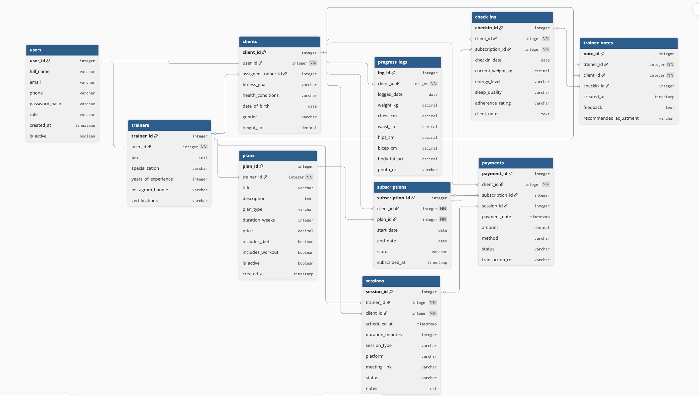

# 🏋️ Fitness Influencer Coaching Platform — Database Design

This folder contains the complete database design (ER diagram and documentation) for an online fitness coaching platform run by a fitness influencer/trainer.

## 📌 Business Overview:

A fitness influencer runs an online coaching business where:
- **Trainers/Coaches** manage multiple clients
- **Clients** can buy coaching plans, attend sessions, and track progress
- The platform supports **consultations**, **live sessions**, **weekly check-ins**, and **progress tracking**
- Clients may subscribe to **long-term coaching plans** or book **one-off consultations**

---

## 🗂️ Entities at a Glance:

| Entity | Purpose |
|--------|---------|
| `USER` | Shared base table for all platform users (trainers + clients) |
| `TRAINER` | Trainer-specific profile — bio, specialization, experience |
| `CLIENT` | Client-specific profile — fitness goals, health info |
| `PLAN` | A coaching program offered by a trainer |
| `SUBSCRIPTION` | A client's enrollment in a plan (with dates + status) |
| `SESSION` | Scheduled live/video consultations between trainer and client |
| `CHECK_IN` | Weekly progress reports submitted by clients |
| `PROGRESS_LOG` | Objective measurements — weight, body metrics over time |
| `TRAINER_NOTE` | Trainer's private feedback/notes on a client |
| `PAYMENT` | Payment records tied to subscriptions or sessions |

---

## 🔧 Notation Used:

- **Crow's Foot notation** in ER diagram
- `PK` = Primary Key, `FK` = Foreign Key
- Cardinality: `||--||` (one-to-one), `||--o{` (one-to-many), `}o--o{` (many-to-many)

---

## 📊 ER Diagram:



---

## 🔑 Design Highlights:

- `USER` is a shared base table — `TRAINER` and `CLIENT` extend it via `user_id` FK (Table-Per-Type inheritance)
- `SUBSCRIPTION` is the junction table resolving the M:N between `CLIENT` and `PLAN`, with extra business data (start/end dates, status)
- `CHECK_IN` and `PROGRESS_LOG` are **separate entities** — check-ins are subjective weekly reports; progress logs are objective body measurements
- `TRAINER_NOTE` stores trainer feedback independently, optionally linked to a specific check-in
- `PAYMENT` can be linked to a subscription **or** a one-off session — both are supported

##### Detailed table decription and its attributes are defined in entities.md file

---
## Table Relationships:

### 1. USER → TRAINER / USER → CLIENT
**Cardinality:** One-to-One (`1:1`)

- A single USER row can be extended to either a TRAINER or CLIENT profile
- `TRAINER.user_id` and `CLIENT.user_id` both have UNIQUE constraints enforcing 1:1

---

### 2. TRAINER → CLIENT
**Cardinality:** One-to-Many (`1:N`)

- One trainer can coach **many clients**
- Each client has one **primary assigned trainer**
- **FK:** `CLIENT.assigned_trainer_id` → `TRAINER.trainer_id`

---

### 3. TRAINER → PLAN
**Cardinality:** One-to-Many (`1:N`)

- One trainer can create **many plans** (e.g., beginner plan, advanced plan, diet-only plan)
- Each plan belongs to **one trainer**
- **FK:** `PLAN.trainer_id` → `TRAINER.trainer_id`

---

### 4. CLIENT ↔ PLAN (via SUBSCRIPTION)
**Cardinality:** Many-to-Many (`M:N`)

- One client can subscribe to **many plans** over time
- One plan can be subscribed to by **many clients**
- **Junction Table:** `SUBSCRIPTION` resolves this with extra data: `start_date`, `end_date`, `status`

---

### 5. TRAINER → SESSION / CLIENT → SESSION
**Cardinality:** One-to-Many (`1:N`) on both sides

- One trainer can conduct **many sessions** across different clients
- One client can attend **many sessions** over time
- **FKs:** `SESSION.trainer_id`, `SESSION.client_id`

---

### 6. CLIENT → CHECK_IN
**Cardinality:** One-to-Many (`1:N`)

- One client submits **many check-ins** (typically weekly)
- Each check-in belongs to **one client**
- **FK:** `CHECK_IN.client_id` → `CLIENT.client_id`
- Also linked to a SUBSCRIPTION to know which active plan the check-in belongs to

---

### 7. CLIENT → PROGRESS_LOG
**Cardinality:** One-to-Many (`1:N`)

- One client can have **many progress log entries** (periodic measurements)
- **FK:** `PROGRESS_LOG.client_id` → `CLIENT.client_id`

---

### 8. CHECK_IN → TRAINER_NOTE
**Cardinality:** One-to-Many (`1:N`)

- One check-in can have **one or more trainer notes** in response
- A trainer note may optionally reference a specific check-in
- **FK:** `TRAINER_NOTE.checkin_id` → `CHECK_IN.checkin_id` (nullable)

---

### 9. ORDER → PAYMENT (SUBSCRIPTION/SESSION)
**Cardinality:** One-to-One (for sessions), One-to-Many (for subscriptions with installments)

- Each PAYMENT links to either a SUBSCRIPTION or a SESSION
- `subscription_id` and `session_id` in PAYMENT are both nullable — only one is filled per payment row

---


# ❓Questions & Answers:

## 1. Who are the trainers and who are the clients?

`USER.role` + `TRAINER` / `CLIENT` tables

| Entity | Attribute | Purpose |
|--------|-----------|---------|
| `USER` | `role` | `'trainer'` or `'client'` |
| `TRAINER` | `trainer_id`, `specialization` | Trainer identity and expertise |
| `CLIENT` | `client_id`, `fitness_goal` | Client identity and goals |

**Query concept:**
```sql
SELECT u.full_name, t.specialization FROM USER u JOIN TRAINER t ON u.user_id = t.user_id;
SELECT u.full_name, c.fitness_goal FROM USER u JOIN CLIENT c ON u.user_id = c.user_id;
```

---

## 2. What plans or coaching programs exist?

`PLAN` table

| Entity | Attribute | Purpose |
|--------|-----------|---------|
| `PLAN` | `title`, `description` | Plan name and overview |
| `PLAN` | `plan_type` | consultation_only / routine_only / full_coaching |
| `PLAN` | `duration_weeks`, `price` | Duration and cost |
| `PLAN` | `includes_diet`, `includes_workout` | What's included |

---

## 3. Which client purchased which plan?

`SUBSCRIPTION` table

| Entity | Attribute | Purpose |
|--------|-----------|---------|
| `SUBSCRIPTION` | `client_id` (FK) | Which client |
| `SUBSCRIPTION` | `plan_id` (FK) | Which plan |
| `SUBSCRIPTION` | `status` | Whether it's active |

**Query concept:**
```sql
SELECT c.client_id, u.full_name, p.title, s.status
FROM SUBSCRIPTION s
JOIN CLIENT c ON s.client_id = c.client_id
JOIN USER u ON c.user_id = u.user_id
JOIN PLAN p ON s.plan_id = p.plan_id;
```

---

## 4. When does a client's plan start and end?

`SUBSCRIPTION.start_date` and `SUBSCRIPTION.end_date`

| Entity | Attribute | Purpose |
|--------|-----------|---------|
| `SUBSCRIPTION` | `start_date` | When the plan began |
| `SUBSCRIPTION` | `end_date` | When the plan expires |
| `SUBSCRIPTION` | `status` | active / paused / completed / cancelled |

---

## 5. Are there consultations or sessions being scheduled?

`SESSION` table

| Entity | Attribute | Purpose |
|--------|-----------|---------|
| `SESSION` | `scheduled_at` | Date & time of the session |
| `SESSION` | `session_type` | consultation / live_training / Q&A |
| `SESSION` | `platform`, `meeting_link` | Where it happens |
| `SESSION` | `status` | scheduled / completed / cancelled |

---

## 6. Are clients submitting check-ins weekly?

`CHECK_IN` table

| Entity | Attribute | Purpose |
|--------|-----------|---------|
| `CHECK_IN` | `checkin_date` | Date of submission |
| `CHECK_IN` | `client_id` | Who submitted |
| `CHECK_IN` | `adherence_rating` | How well they followed the plan |
| `CHECK_IN` | `energy_level`, `sleep_quality` | Lifestyle indicators |
| `CHECK_IN` | `client_notes` | What the client wants to share |

---

## 7. How is progress being tracked?

`PROGRESS_LOG` table (objective) + `CHECK_IN` table (subjective)

| Entity | Attribute | Purpose |
|--------|-----------|---------|
| `PROGRESS_LOG` | `weight_kg`, `waist_cm`, etc. | Objective body measurements |
| `PROGRESS_LOG` | `body_fat_pct` | Fitness progress indicator |
| `PROGRESS_LOG` | `photo_url` | Visual progress tracking |
| `CHECK_IN` | `current_weight_kg`, `energy_level` | Self-reported progress |

---

## 8. Can multiple clients enroll in the same program?

`SUBSCRIPTION` (M:N junction table)

- Multiple rows in `SUBSCRIPTION` can share the same `plan_id` with different `client_id` values
- One plan → many subscriptions → many clients ✅

---

## 9. Can one trainer handle many clients?

`CLIENT.assigned_trainer_id` → `TRAINER.trainer_id` (One-to-Many)

- Many CLIENT rows can point to the same `assigned_trainer_id`
- One trainer → many clients ✅

---

## 10. How should payment and subscription information be stored?

`PAYMENT` + `SUBSCRIPTION` tables

| Type | Entity | Key Fields |
|------|--------|-----------|
| Plan payment | `PAYMENT` | `subscription_id` FK, `amount`, `status`, `method` |
| Consultation payment | `PAYMENT` | `session_id` FK, `amount`, `status`, `method` |
| Subscription details | `SUBSCRIPTION` | `start_date`, `end_date`, `status` |

