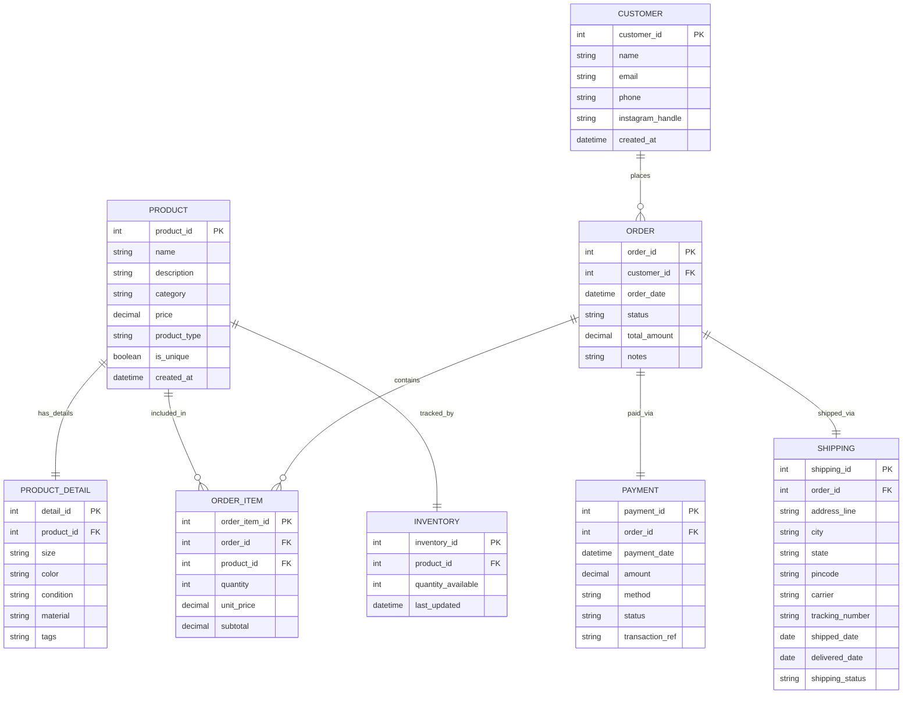

# 🛍️ Instagram Thrift Creator Store — Database Design

ER diagram and documentation for an Instagram-based thrift + handmade creator store.

## 📌 Business Overview:

A small creator sells two types of products:
- **Thrifted fashion items** – unique, one-of-a-kind pieces
- **Handmade products** – made in batches, multiple units available

The store needs a database to manage products, inventory, customer orders, payments, and shipping.

---

## 🗂️ Entities at a Glance:

| Entity | Purpose |
|--------|---------|
| `CUSTOMER` | Stores customer contact and profile info |
| `PRODUCT` | Core product info — name, type, price |
| `PRODUCT_DETAIL` | Product-specific extras — size, color, condition |
| `INVENTORY` | Tracks stock quantity per product |
| `ORDER` | A customer's purchase request |
| `ORDER_ITEM` | Junction table — which products are in which order |
| `PAYMENT` | Payment status and method for an order |
| `SHIPPING` | Delivery address and shipping status for an order |

---

## 🔧 Notation Used:

- **Crow's Foot notation** in the ER diagram
- `PK` = Primary Key, `FK` = Foreign Key
- Cardinality: `||--||` (one-to-one), `||--o{` (one-to-many)

---

## ER Diagram:

---

## 🔑 Design Highlights:

- `ORDER_ITEM` is a **junction table** that resolves the many-to-many relationship between `ORDER` and `PRODUCT`
- `PRODUCT_DETAIL` stores optional product metadata (size, color, condition) separately to keep `PRODUCT` clean
- `INVENTORY` is separate to allow flexible stock tracking (thrifted = 1, handmade = many)
- `PAYMENT` and `SHIPPING` are separate entities to avoid nulls and keep `ORDER` normalized

##### Detailed table decription and its attributes are defined in entities.md file
---

## Table Relationships:

### 1. CUSTOMER → ORDER
**Cardinality:** One-to-Many (`1 : N`)

- One customer can place **many orders** over time
- Each order belongs to **exactly one customer**
- **FK:** `ORDER.customer_id` → `CUSTOMER.customer_id`

---

### 2. ORDER → ORDER_ITEM
**Cardinality:** One-to-Many (`1 : N`)

- One order can contain **many order items** (multiple products)
- Each order item belongs to **exactly one order**
- **FK:** `ORDER_ITEM.order_id` → `ORDER.order_id`

---

### 3. PRODUCT → ORDER_ITEM
**Cardinality:** One-to-Many (`1 : N`)

- One product can appear in **many order items** (across different orders)
- Each order item references **exactly one product**
- **FK:** `ORDER_ITEM.product_id` → `PRODUCT.product_id`

---

### 4. ORDER ↔ PRODUCT (via ORDER_ITEM)
**Cardinality:** Many-to-Many (`M : N`)

- One order can contain **many products**
- One product can be part of **many orders**
- **Junction Table:** `ORDER_ITEM` resolves this M:N relationship
- `ORDER_ITEM` stores additional attributes per line item: `quantity`, `unit_price`, `subtotal`

**Why ORDER_ITEM as a junction table?**
> Without `ORDER_ITEM`, we cannot represent which products belong to which order without repeating data. The junction table allows us to store quantity and price at the time of purchase, which may differ from the current product price.

---

### 5. PRODUCT → PRODUCT_DETAIL
**Cardinality:** One-to-One (`1 : 1`)

- Each product has **exactly one** detail record
- Each detail record belongs to **exactly one** product
- **FK:** `PRODUCT_DETAIL.product_id` → `PRODUCT.product_id` (UNIQUE constraint enforces 1:1)

---

### 6. PRODUCT → INVENTORY
**Cardinality:** One-to-One (`1 : 1`)

- Each product has **exactly one** inventory record
- Each inventory record tracks **exactly one** product
- **FK:** `INVENTORY.product_id` → `PRODUCT.product_id` (UNIQUE constraint enforces 1:1)

---

### 7. ORDER → PAYMENT
**Cardinality:** One-to-One (`1 : 1`)

- Each order has **exactly one** payment record
- Each payment belongs to **exactly one** order
- **FK:** `PAYMENT.order_id` → `ORDER.order_id` (UNIQUE constraint enforces 1:1)

---

### 8. ORDER → SHIPPING
**Cardinality:** One-to-One (`1 : 1`)

- Each order has **exactly one** shipping record
- Each shipping record belongs to **exactly one** order
- **FK:** `SHIPPING.order_id` → `ORDER.order_id` (UNIQUE constraint enforces 1:1)

---

# ❓ Questions & Answers:

## 1. What products are being sold?

 `PRODUCT` table

| Entity | Attribute | Purpose |
|--------|-----------|---------|
| `PRODUCT` | `name` | Product name |
| `PRODUCT` | `description` | What the product is |
| `PRODUCT` | `category` | Type (Tops, Bottoms, Accessories, etc.) |
| `PRODUCT` | `price` | Selling price |

---

## 2. Are they thrifted items or handmade items?

 `PRODUCT.product_type` and `PRODUCT.is_unique`

| Entity | Attribute | Values |
|--------|-----------|--------|
| `PRODUCT` | `product_type` | `'thrifted'` or `'handmade'` |
| `PRODUCT` | `is_unique` | `TRUE` (one-of-a-kind) or `FALSE` (multiple units) |

---

## 3. How many pieces are available?

 `INVENTORY.quantity_available`

| Entity | Attribute | Purpose |
|--------|-----------|---------|
| `INVENTORY` | `quantity_available` | Current stock count |
| `INVENTORY` | `last_updated` | When stock was last updated |

---

## 4. Which customer placed which order?

 `ORDER.customer_id` → `CUSTOMER`

| Entity | Attribute | Purpose |
|--------|-----------|---------|
| `ORDER` | `customer_id` (FK) | Links order to the customer |
| `CUSTOMER` | `name`, `phone`, `instagram_handle` | Customer identity |

---

## 5. What all items were part of one order?

 `ORDER_ITEM` (junction table)

| Entity | Attribute | Purpose |
|--------|-----------|---------|
| `ORDER_ITEM` | `order_id` (FK) | Which order |
| `ORDER_ITEM` | `product_id` (FK) | Which product |
| `ORDER_ITEM` | `quantity` | How many units |
| `ORDER_ITEM` | `unit_price` | Price at time of order |

---

## 6. Was the order paid for?

 `PAYMENT.status` and `PAYMENT.method`

| Entity | Attribute | Values |
|--------|-----------|--------|
| `PAYMENT` | `status` | `'pending'`, `'paid'`, `'failed'`, `'refunded'` |
| `PAYMENT` | `method` | `'UPI'`, `'bank_transfer'`, `'cash'`, `'COD'` |
| `PAYMENT` | `transaction_ref` | Reference number for verification |

---

## 7. Has the order been shipped or delivered?

 `SHIPPING.shipping_status` and `SHIPPING.delivered_date`

| Entity | Attribute | Values |
|--------|-----------|--------|
| `SHIPPING` | `shipping_status` | `'not_shipped'`, `'shipped'`, `'out_for_delivery'`, `'delivered'`, `'returned'` |
| `SHIPPING` | `tracking_number` | For customer tracking |
| `SHIPPING` | `shipped_date` | When dispatched |
| `SHIPPING` | `delivered_date` | When delivered |

---

## 8. Can one customer place multiple orders?

 `CUSTOMER` → `ORDER` (One-to-Many relationship)

- `ORDER.customer_id` is a FK that allows **multiple ORDER rows** for the same `customer_id`
- No UNIQUE constraint on `customer_id` in the ORDER table → one customer, many orders

---

## 9. Can one order contain multiple products?

 `ORDER_ITEM` (junction table)

- `ORDER_ITEM` allows **multiple rows with the same `order_id`** but different `product_id` values
- This is the M:N resolution — one order, many products

---

## 10. How do we store product-specific details like size, category, color, condition, or price?

 Multiple attributes across `PRODUCT` and `PRODUCT_DETAIL`

| Detail | Entity | Attribute |
|--------|--------|-----------|
| Category | `PRODUCT` | `category` |
| Price | `PRODUCT` | `price` |
| Size | `PRODUCT_DETAIL` | `size` |
| Color | `PRODUCT_DETAIL` | `color` |
| Condition | `PRODUCT_DETAIL` | `condition` |
| Material | `PRODUCT_DETAIL` | `material` |
| Tags | `PRODUCT_DETAIL` | `tags` |