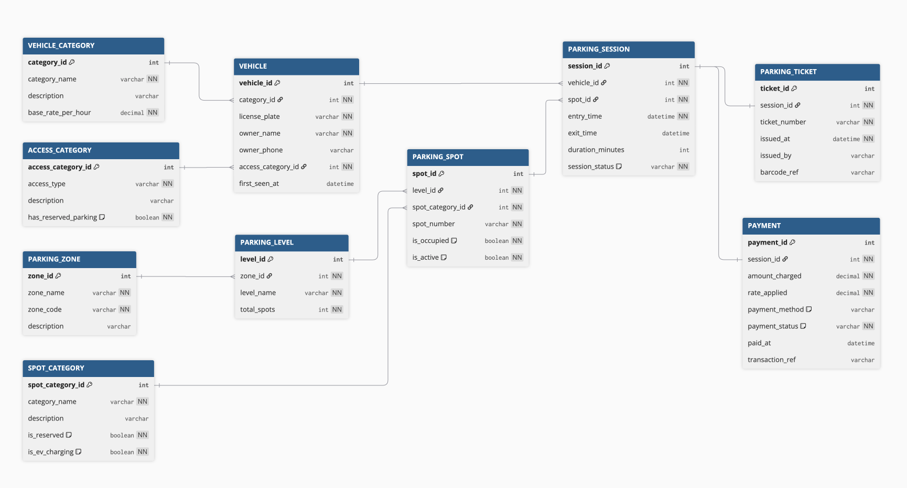

# 🚗 Comic-Con India — Parking System Database Design

ER diagram and documentation for the multi-zone event parking system at Comic-Con India.

## 📌 Business Overview

A large convention venue hosts Comic-Con India across multiple days. Thousands of visitors arrive via bikes, cars, SUVs, cabs, and EVs. The parking facility is:
- Divided into **multiple zones and levels**
- Has **reserved categories** for VIP guests, exhibitors, staff, cosplayers with props, and EV charging
- Issues a **parking ticket** on every entry
- Tracks **entry and exit timestamps** per session
- Calculates and records **parking fees** on exit

---

## 🗂️ Entities at a Glance

| Entity | Purpose |
|--------|---------|
| `VEHICLE_CATEGORY` | Master list of vehicle types (bike, car, SUV, cab, EV) |
| `VEHICLE` | Registered vehicles entering the facility |
| `PARKING_ZONE` | Top-level zone divisions within the venue (Zone A, B, C…) |
| `PARKING_LEVEL` | Levels within a zone (Ground, L1, L2…) |
| `SPOT_CATEGORY` | Types of spots — general, VIP, exhibitor, staff, EV charging, cosplayer |
| `PARKING_SPOT` | Individual numbered spots within a level |
| `ACCESS_CATEGORY` | Special access types for people (VIP, exhibitor, staff, cosplayer, general) |
| `PARKING_SESSION` | One entry-exit cycle for a vehicle at a specific spot |
| `PARKING_TICKET` | The ticket issued at entry, linked to a session |
| `PAYMENT` | Fee record linked to a completed parking session |

---

## 🔧 Notation Used

- **Crow's Foot notation** in the ER diagram
- `🔑` = Primary Key, `🔗` = Foreign Key

---

## 📊 ER Diagram:

##### Detailed table decription and its attributes are defined in entities.md file
---

## Table Relationships:

### 1. VEHICLE_CATEGORY → VEHICLE
**Cardinality:** One-to-Many (`1:N`)

- One vehicle category (e.g., Car) can have **many vehicles** registered under it
- Each vehicle belongs to **exactly one category**
- **FK:** `VEHICLE.category_id`

---

### 2. ACCESS_CATEGORY → VEHICLE
**Cardinality:** One-to-Many (`1:N`)

- One access category (e.g., VIP Guest) can apply to **many vehicles**
- Each vehicle has **one access category**
- **FK:** `VEHICLE.access_category_id`

---

### 3. PARKING_ZONE → PARKING_LEVEL
**Cardinality:** One-to-Many (`1:N`)

- One zone contains **many levels** (Ground, L1, L2…)
- Each level belongs to **one zone**
- **FK:** `PARKING_LEVEL.zone_id`

---

### 4. PARKING_LEVEL → PARKING_SPOT
**Cardinality:** One-to-Many (`1:N`)

- One level contains **many individual parking spots**
- Each spot belongs to **one level**
- **FK:** `PARKING_SPOT.level_id`

---

### 5. SPOT_CATEGORY → PARKING_SPOT
**Cardinality:** One-to-Many (`1:N`)

- One spot category (e.g., EV Charging) applies to **many spots**
- Each spot has **one category**
- **FK:** `PARKING_SPOT.spot_category_id`

---

### 6. VEHICLE → PARKING_SESSION
**Cardinality:** One-to-Many (`1:N`)

- One vehicle can have **many parking sessions** across different event days or re-entries
- Each session belongs to **one vehicle**
- **FK:** `PARKING_SESSION.vehicle_id`

---

### 7. PARKING_SPOT → PARKING_SESSION (Spot Reuse)
**Cardinality:** One-to-Many (`1:N`)

- One parking spot can host **many sessions over time**
- Each session uses **one specific spot**
- **FK:** `PARKING_SESSION.spot_id`

---

### 8. PARKING_SESSION → PARKING_TICKET
**Cardinality:** One-to-One (`1:1`)

- Every parking session generates **exactly one ticket**
- Every ticket corresponds to **exactly one session**
- **FK:** `PARKING_TICKET.session_id` (UNIQUE constraint enforces 1:1)

---

### 9. PARKING_SESSION → PAYMENT
**Cardinality:** One-to-One (`1:1`)

- Every parking session has **exactly one payment record**
- Every payment record belongs to **exactly one session**
- **FK:** `PAYMENT.session_id` (UNIQUE constraint enforces 1:1)