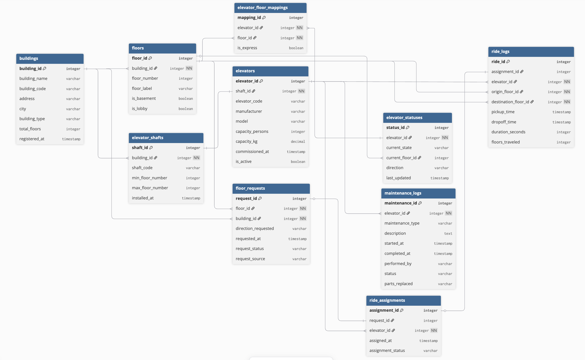

# 🛗 LiftGrid Systems — Smart Elevator Control Platform Database Design

ER diagram and documentation for LiftGrid Systems' intelligent elevator control platform used across large commercial buildings in India.

## 📌 Business Overview:

LiftGrid Systems manages elevator infrastructure across:
- **Corporate towers, malls, airports, hospitals, and high-rise residential complexes**
- Multiple buildings, each with multiple elevator shafts
- Thousands of ride requests and completions daily
- Real-time elevator status monitoring
- Maintenance tracking and ride log analytics

---

## 🗂️ Entities at a Glance:

| Entity | Purpose |
|--------|---------|
| `BUILDING` | A physical building connected to the LiftGrid platform |
| `FLOOR` | Individual floors within a building |
| `ELEVATOR_SHAFT` | Physical shaft in a building housing one elevator |
| `ELEVATOR` | The elevator unit installed in a shaft |
| `ELEVATOR_FLOOR_MAPPING` | Junction table — which elevators serve which floors (M:N) |
| `ELEVATOR_STATUS` | Live operational status of each elevator (separate from config) |
| `FLOOR_REQUEST` | A ride request generated from a floor by a user |
| `RIDE_ASSIGNMENT` | The assignment of a specific elevator to handle a specific request |
| `RIDE_LOG` | Historical record of a completed ride trip |
| `MAINTENANCE_LOG` | Maintenance events and history per elevator |

---

## 🔧 Notation Used:

- **Crow's Foot notation** in the ER diagram
- `🔑` = Primary Key, `🔗` = Foreign Key

---

## 📊 ER Diagram:

##### Detailed table decription and its attributes are defined in entities.md file

---

## Table Relationships:

### 1. BUILDING → FLOOR
**Cardinality:** One-to-Many (`1:N`)

- One building has **many floors**
- Each floor belongs to **exactly one building**
- **FK:** `FLOOR.building_id`

---

### 2. BUILDING → ELEVATOR_SHAFT
**Cardinality:** One-to-Many (`1:N`)

- One building contains **many elevator shafts**
- Each shaft belongs to **exactly one building**
- **FK:** `ELEVATOR_SHAFT.building_id`

---

### 3. ELEVATOR_SHAFT → ELEVATOR
**Cardinality:** One-to-One (`1:1`)

- One shaft houses **exactly one elevator**
- One elevator occupies **exactly one shaft**
- **FK:** `ELEVATOR.shaft_id` (UNIQUE constraint enforces 1:1)

---

### 4. ELEVATOR ↔ FLOOR (via ELEVATOR_FLOOR_MAPPING)
**Cardinality:** Many-to-Many (`M:N`)

- One elevator can **serve many floors**
- One floor can be **served by many elevators**
- **Junction Table:** `ELEVATOR_FLOOR_MAPPING` with extra field `is_express`

---

### 5. ELEVATOR → ELEVATOR_STATUS
**Cardinality:** One-to-One (`1:1`)

- Each elevator has **exactly one live status record**
- Each status record belongs to **exactly one elevator**
- **FK:** `ELEVATOR_STATUS.elevator_id` (UNIQUE constraint enforces 1:1)

---

### 6. FLOOR → FLOOR_REQUEST
**Cardinality:** One-to-Many (`1:N`)

- One floor can generate **many requests** over time
- Each request originates from **exactly one floor**
- **FK:** `FLOOR_REQUEST.floor_id`

---

### 7. FLOOR_REQUEST → RIDE_ASSIGNMENT
**Cardinality:** One-to-Zero/One (`1:0..1`)

- One request produces **at most one assignment**
- A pending request has no assignment yet
- A cancelled request has no assignment
- **FK:** `RIDE_ASSIGNMENT.request_id` (UNIQUE)

---

### 8. ELEVATOR → RIDE_ASSIGNMENT
**Cardinality:** One-to-Many (`1:N`)

- One elevator can handle **many assignments** throughout the day
- Each assignment is given to **one elevator**
- **FK:** `RIDE_ASSIGNMENT.elevator_id`

---

### 9. RIDE_ASSIGNMENT → RIDE_LOG
**Cardinality:** One-to-Zero/One (`1:0..1`)

- A completed assignment produces **one ride log entry**
- A failed or in-progress assignment may have no ride log yet
- **FK:** `RIDE_LOG.assignment_id` (UNIQUE)

---

### 10. ELEVATOR → MAINTENANCE_LOG
**Cardinality:** One-to-Many (`1:N`)

- One elevator can have **many maintenance events** over its lifetime
- Each maintenance log entry belongs to **one elevator**
- **FK:** `MAINTENANCE_LOG.elevator_id`