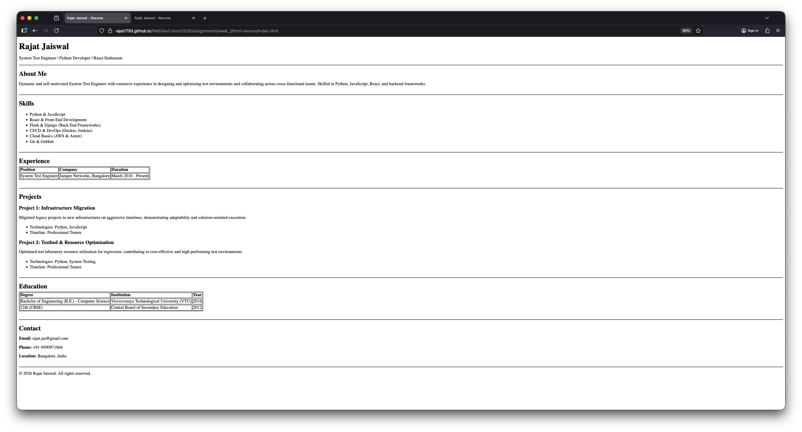

# HTML Resume Page Assignment

A simple single-page resume website built as part of the Web Dev Cohort 2026. This project showcases the use of proper HTML5 structure, tables for data organization



## 🚀 Features
- **Semantic HTML5**: Uses appropriate tags like `<header>`, `<section>`, `<hr>`, and `<footer>`
- **Experience & Education Tables**: Organized professional and academic history using HTML tables
- **Responsive Layout**: Clean, readable design that follows the provided layout


## 📂 Project Structure
- `index.html`: The main entry point containing all HTML structure
- `README.md`: Project documentation and setup guide

## 🛠️ Setup & Usage
No complex installation is required to view this project locally

1. **Clone the Repository**:
   ```bash
   git clone [WebDevCohort2026](https://github.com/Rajat1793/WebDevCohort2026.git)
2. **Navigate to the Assignment Directory**:
   ```bash
   cd WebDevCohort2026/assignments/week_1/html-resume
3. **Open `index.html` in Your Browser**:
   - Double-click the `index.html` file, or
   - Right-click and select "Open with" followed by your preferred web browser.

## 📄 Live Demo
View the live version of the HTML Resume [here](https://rajat1793.github.io/WebDevCohort2026/assignments/week_1/html-resume/)
