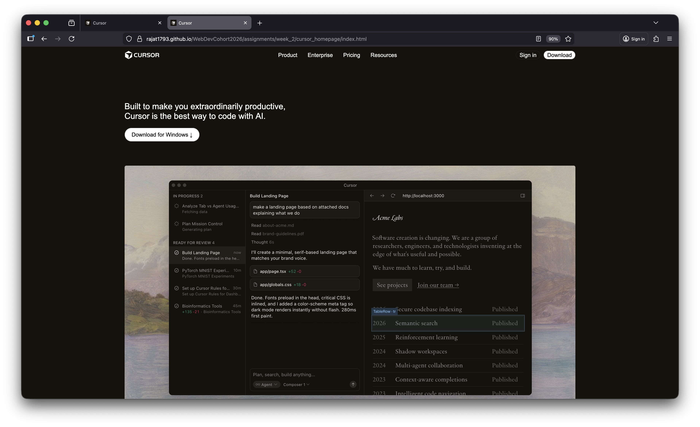
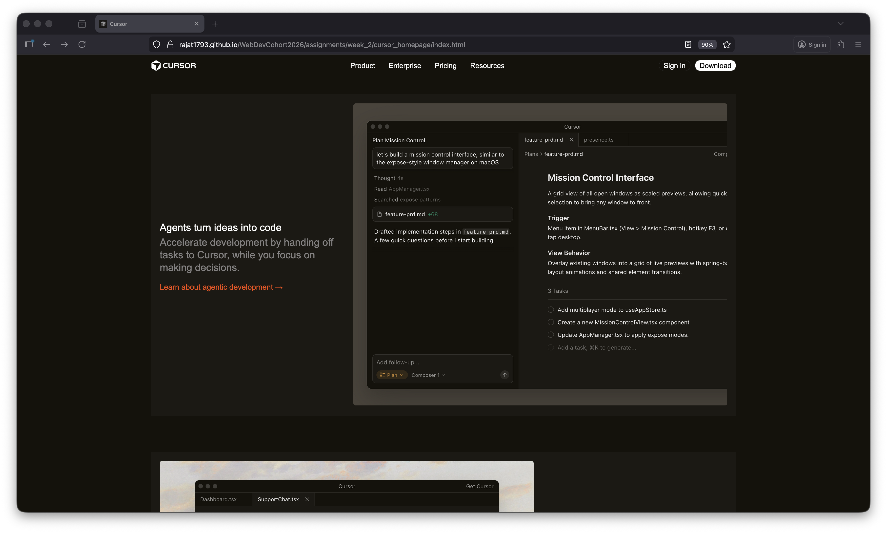
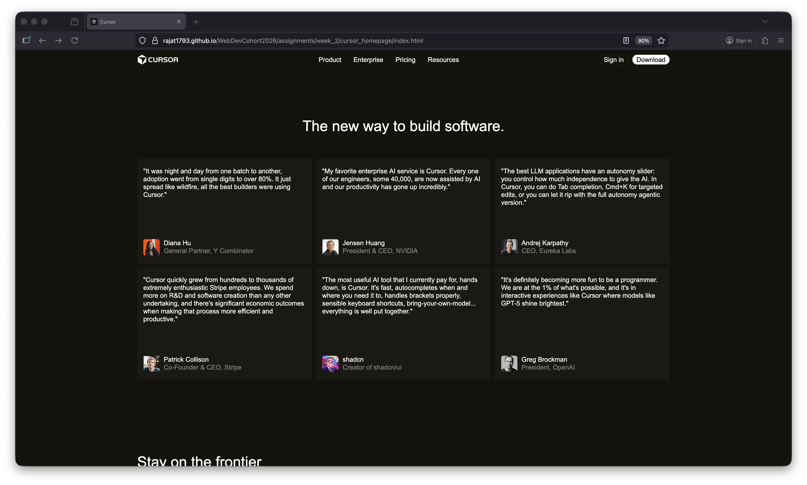

# Cursor Homepage Clone

A pixel-perfect recreation of the Cursor homepage using HTML and CSS.



## 💻 [Live Demo](https://rajat1793.github.io/WebDevCohort2026/assignments/week_2/cursor_homepage/index.html)

## 🚀 Features

- Semantic HTML5 structure
- Modern CSS with Flexbox & Grid
- CSS Variables for theming
- Sticky navigation bar
- Custom CursorGothic font family
- Responsive grid layouts
- Optimized and clean code

## 🎨 Color Palette

| Color | Hex Code | Usage |
|-------|----------|-------|
| Primary Background | `#14120B` | Main background color |
| Secondary Background | `#1B1913` | Cards, sections |
| Tertiary Background | `#201E18` | Nested elements |
| Text Light | `#EDECEC` | Body text |
| Text Secondary | `#949390` | Muted text |


## 🛠 Tech Stack

- HTML5
- CSS3
- CursorGothic Custom Font
- SVG Graphics  

## 📂 Structure

```
cursor_homepage/
├── index.html
├── style.css
├── README.md
├── assets/
└── fonts/
    └── CursorGothic-Regular2.woff2
```

## ⚙️ Setup

Simply open `index.html` in your browser, or use a live server:

```bash
# VS Code Live Server
Right-click on index.html → Open with Live Server
```

## 📸 Screenshots





## 📝 Credits

**Original Design:** [Cursor](https://cursor.com)  
**Developer:** Rajat Jaiswal  
**Assignment:** Week 2 - Web Development Cohort 2026

---

*This is a learning project created for educational purposes only.*