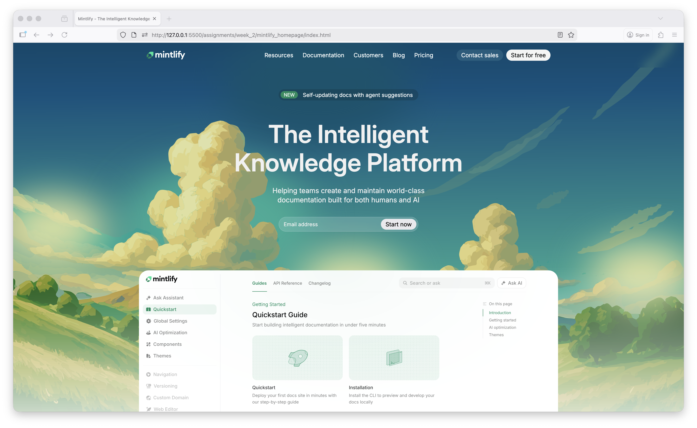
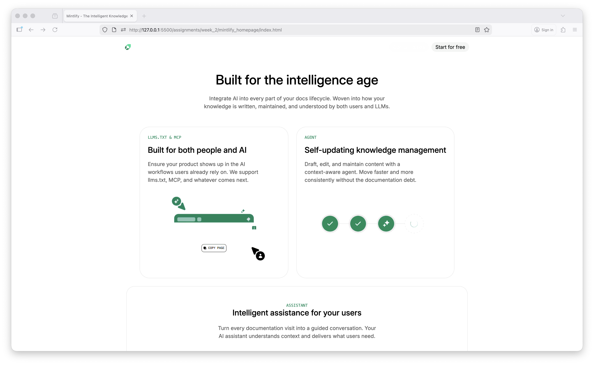
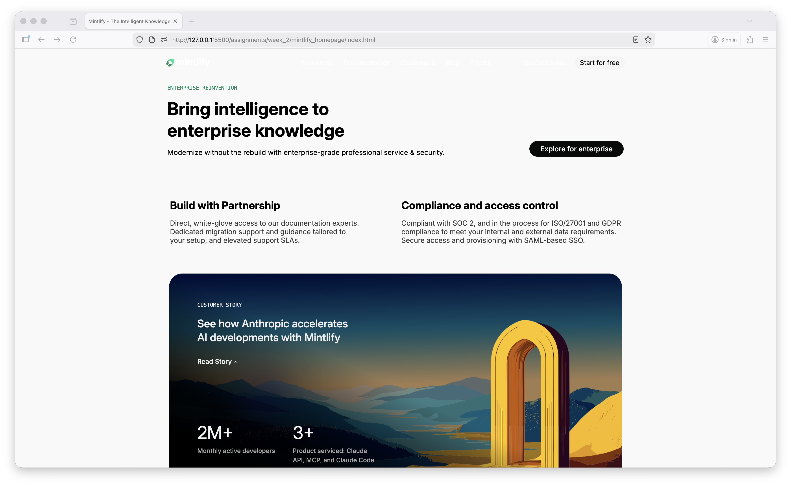

# Mintlify Homepage Clone

A pixel-perfect recreation of the Mintlify homepage using HTML and CSS.



## 💻 [Live Demo](https://rajat1793.github.io/WebDevCohort2026/assignments/week_2/mintlify_homepage/index.html)

## 🚀 Features

- Semantic HTML5 structure
- Modern CSS with Flexbox & Grid
- CSS Variables for theming
- Fixed navigation with backdrop blur
- Optimized and clean code

## 🎨 Color Palette

| Color | Hex Code | Usage |
|-------|----------|-------|
| Light | `#f1f1f1` | Light backgrounds |
| Background | `#f4f5f4` | Main page background |
| Gray | `#585858` | Secondary text |
| Brand Green | `#0c8c5e` | Primary brand color, CTAs |
| Border | `#e8e8e8` | Dividers, borders |

## 🔤 Typography

| Font | Usage | Source |
|------|-------|--------|
| **Inter** | Primary font for all text | Google Fonts |
| **Geist Mono** | Code snippets, monospace elements | System/Web Font |

## 🛠 Tech Stack

- HTML5
- CSS3
- CSS Variables & Custom Properties
- Google Fonts API (Inter)
- SVG Graphics
- Backdrop Filter Effects

## 📂 Structure

```
mintlify_homepage/
├── index.html
├── style.css
├── README.md
└── assets/
```

## ⚙️ Setup

Simply open `index.html` in your browser, or use a live server:

```bash
# VS Code Live Server
Right-click on index.html → Open with Live Server
```

## 📸 Screenshots





## 📝 Credits

**Original Design:** [Mintlify](https://mintlify.com)  
**Developer:** Rajat Jaiswal
**Assignment:** Week 2 - Web Development Cohort 2026

---

*This is a learning project created for educational purposes only.*